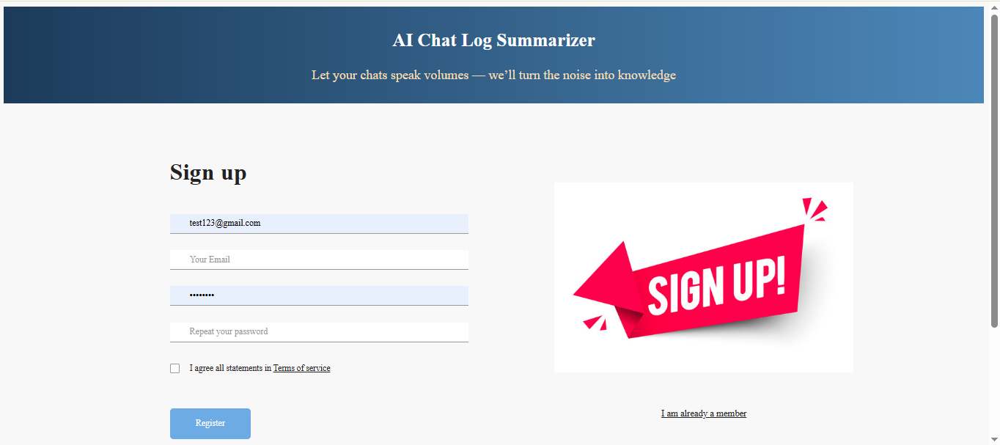
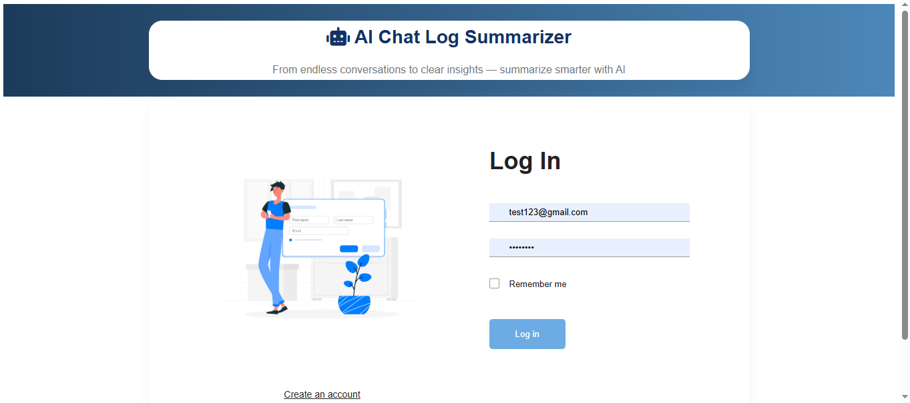
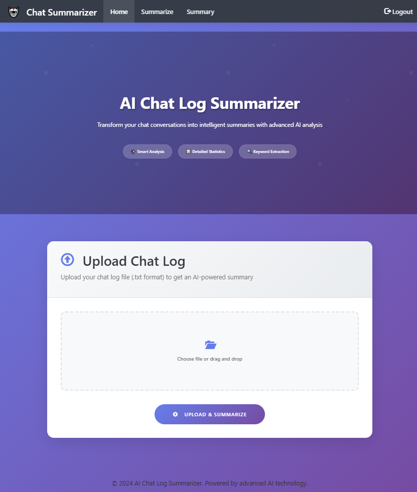
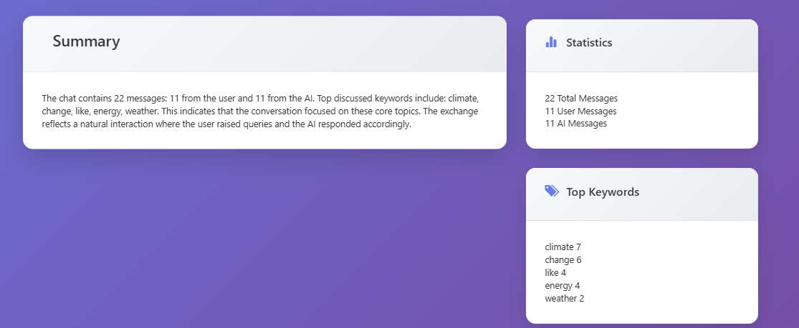

# AI Chat Log Summarizer

**AI Chat Log Summarizer** is a web application that transforms chat conversation logs into intelligent summaries using advanced AI analysis. It provides detailed statistics and keyword extraction to help users quickly understand the essence of long chat conversations.

---

## Features
-  Secure authentication system
- **Upload chat log files (.txt)** for AI-powered summarization  
- **Smart analysis** that captures key points and themes  
- **Detailed message statistics**, including total, user, and AI messages  
- **Top keyword extraction** for quick insights  
- Responsive and modern UI built with Bootstrap 5  

---

## Demo
<table>
  <tr>
    <td></td>
    <td></td>
  </tr>
</table>





---

## Technologies Used

- Frontend: HTML5, CSS3, Bootstrap 5 
- Backend: Python, Flask
- AI Summarization: nltk

---

## Installation

1. Clone the repository:  
   ```bash
   git clone https://github.com/yourusername/ai-chat-log-summarizer.git
   cd ai-chat-log-summarizer
   ```

2. (Optional) Create and activate a virtual environment if using Python backend:  
   ```bash
   python -m venv venv
   source venv/bin/activate  # On Windows use: venv\Scripts\activate
   ```

3. Install dependencies:  
   ```bash
   pip install -r requirements.txt
   ```

4. Run the application:  
   ```bash
   flask run  # or your framework's start command
   ```

5. Open your browser at `http://localhost:5000`

---

## Usage

- Navigate to the **Summarize** section.  
- Upload your chat log file in `.txt` format.  
- Click **Upload & Summarize** to receive an AI-generated summary, message statistics, and keyword list.

---


## Contact

Created by [Meehdi Hasan] - feel free to reach out via [mh.majumdar1952@gmail.com](mailto:mh.majumdar1952@gmail.com) or [LinkedIn](https://www.linkedin.com/in/hasanmehedi1952/).


---

*Powered by advanced AI technology to make your chat logs easier to understand.*
